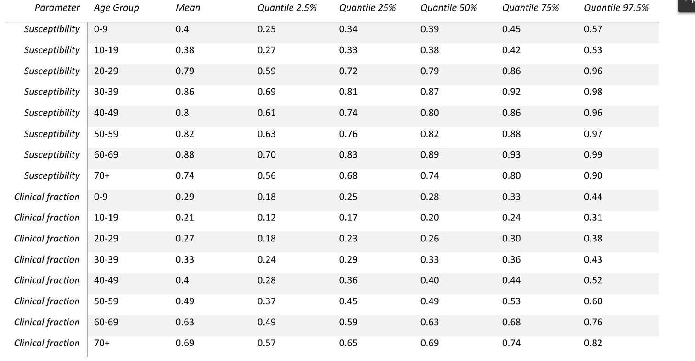
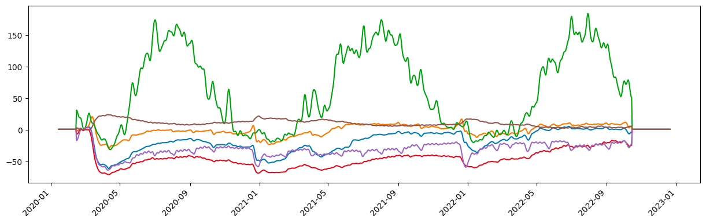
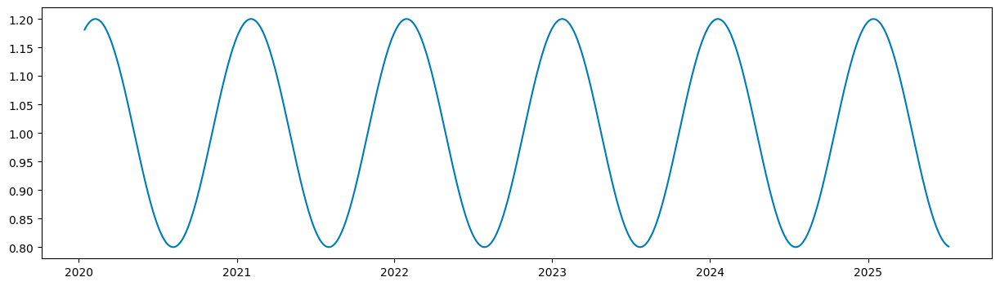

# Commuting_TSF_SARS-Cov-2_model_master
***加了TODO的是还没做的，没加的就是做好了的***
# 1. Data collection 
We use 16 age-bands for our model. For the data collected that does not match this specification, 
we will use DOG to upsample/downsample it back to 16 age bands.
## 1.1 常数项 （非时序类型数据）
### 1.1.1 ***TODO:*** 每个年龄段新冠患者的无症状比例
* Shape : (16, ), dtype = float
* Source: **还没找到**
### 1.1.2 ***TODO:*** 每个年龄段新冠患者的住院比例 (need calibration)
* Shape : (16, ), dtype = float
* Source: Davies NG, Barnard RC, Jarvis CI, et al. Association of tiered restrictions
and a second lockdown with COVID-19 deaths and hospital admissions in England:
a modelling study. Lancet Infect Dis 2020; published online Dec 23. https://doi.org/10.1016/S1473-3099(20)30984-1.
### 1.1.3 ***TODO:*** 每个年龄段新冠患者的死亡率
* Shape : (16, ), dtype = float
* Source: **还没找到**
### 1.1.4 ***TODO:*** 每个年龄段新冠患者的死亡率
* Shape : (16, ), dtype = float
* Source: **还没找到**
### 1.1.5 ***TODO:*** 每个年龄段新冠疫苗接种者的疫苗有效率
* Shape : (16, ), dtype = float
* Source: **还没找到**

## 1.2 时序数据
### 1.2.1 每个公共卫生局，每个年龄段，在过去2年（至2020年2月15日）每天的新增新冠确诊，死亡数
* Shape : (34, 925, 16), dtype = int \
**34**: 34个共同卫生局 \
**925**: 925天 \
**16**: 16个年龄段
* Source: https://data.ontario.ca/en/dataset?groups=2019-novel-coronavirus
### 1.2.2 每个年龄段，在过去2年（至2020年2月15日）的每天新增新冠疫苗接种数量
* Shape : (925, 16, 3), dtype = int \
**925**: 925天 \
**16**: 16个年龄段 \
**3**: 疫苗的3针
* Source: https://data.ontario.ca/en/dataset?groups=2019-novel-coronavirus
### 1.2.3 每个类别，在过去两年（至2020年2月15日）的每天的google mobility
* Shape : (925, 6), dtype = float \
**925**: 925天 \
**6**: 6个mobility种类（工作，通勤，娱乐，公园，商店，其他） 
* Source:https://www.google.com/covid19/mobility/
* ### 1.2.4 每个类别，在未来三年的每天的google mobility
* Shape : (365 * 3, 6), dtype = float \
**365 * 3**: 3年 \
**6**: 6个mobility种类（工作，通勤，娱乐，公园，商店，其他） 
* Source: 时间序列预测
* 
* 
* 