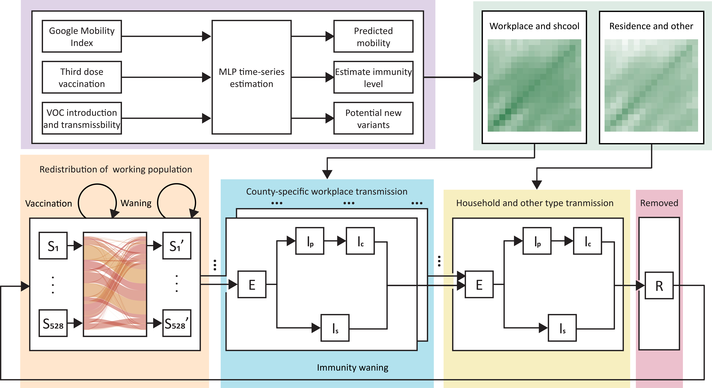
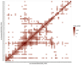
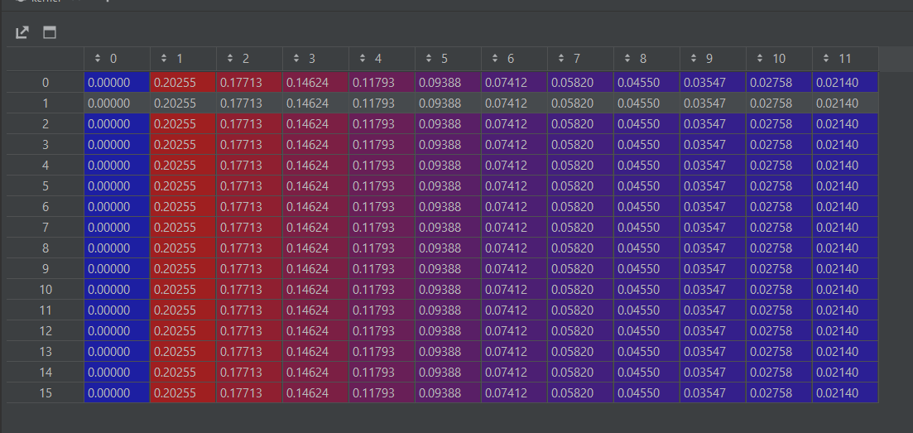
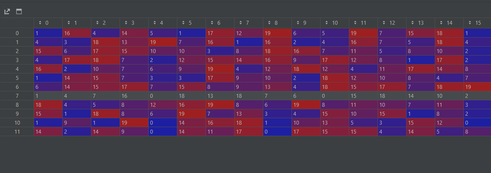
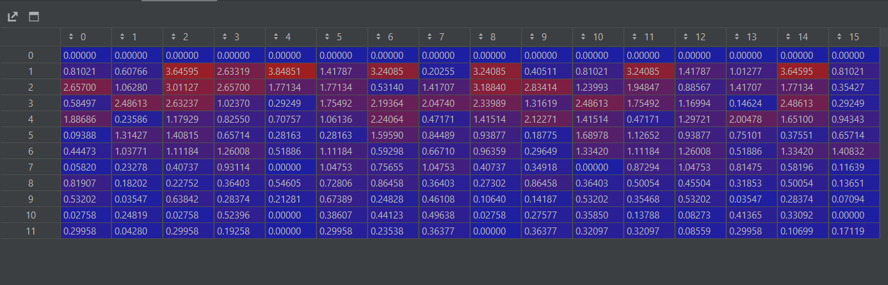
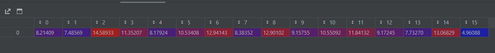

# Commuting_TSF_SARS-Cov-2_model_master
***加了TODO的是还没做的，没加的就是做好了的***
# 1. Data collection 
We use 16 age-bands for our model. For the data collected that does not match this specification, 
we will use DOG to upsample/downsample it back to 16 age bands.
## 1.1 常数项 （非时序类型数据）
### 1.1.1 ***TODO:*** 每个年龄段新冠患者的无症状比例
* Shape : (16, ), dtype = float
* Source: **还没找到**
### 1.1.2 ***TODO:*** 每个年龄段新冠患者的住院比例 (need calibration)
* Shape : (16, ), dtype = float
* Source: Davies NG, Barnard RC, Jarvis CI, et al. Association of tiered restrictions
and a second lockdown with COVID-19 deaths and hospital admissions in England:
a modelling study. Lancet Infect Dis 2020; published online Dec 23. https://doi.org/10.1016/S1473-3099(20)30984-1.
### 1.1.3 ***TODO:*** 每个年龄段新冠患者的死亡率
* Shape : (16, ), dtype = float
* Source: **还没找到**
### 1.1.4 ***TODO:*** 每个年龄段新冠患者的死亡率
* Shape : (16, ), dtype = float
* Source: **还没找到**
### 1.1.5 ***TODO:*** 每个年龄段新冠疫苗接种者的疫苗有效率
* Shape : (16, ), dtype = float
* Source: **还没找到**

## 1.2 时序数据
### 1.2.1 每个公共卫生局，每个年龄段，在过去2年（至2020年2月15日）每天的新增新冠确诊，死亡数
* Shape : (34, 925, 16), dtype = int \
**34**: 34个共同卫生局 \
**925**: 925天 \
**16**: 16个年龄段
* Source: https://data.ontario.ca/en/dataset?groups=2019-novel-coronavirus
### 1.2.2 每个年龄段，在过去2年（至2020年2月15日）的每天新增新冠疫苗接种数量
* Shape : (925, 16, 3), dtype = int \
**925**: 925天 \
**16**: 16个年龄段 \
**3**: 疫苗的3针
* Source: https://data.ontario.ca/en/dataset?groups=2019-novel-coronavirus
### 1.2.3 每个类别，在过去两年（至2020年2月15日）的每天的google mobility
* Shape : (925, 6), dtype = float \
**925**: 925天 \
**6**: 6个mobility种类（工作，通勤，娱乐，公园，商店，其他） 
* Source:https://www.google.com/covid19/mobility/
* ### 1.2.4 每个类别，在未来三年的每天的google mobility
* Shape : (365 * 3, 6), dtype = float \
**365 * 3**: 3年 \
**6**: 6个mobility种类（工作，通勤，娱乐，公园，商店，其他） 
* Source: 时间序列预测

下面这三张截图是前supervisor Davies NG的类似论文中使用的参数。
一些参数可以直接套用，但还有一些由于不是age-specific，需要我们再去自己查
### **论文在这里**： https://doi.org/10.1016/S1473-3099(20)30984-1

# 2. 模型结构
模型结构介绍: https://github.com/blairyeung/Commuting_TSF_SARS-Cov-2_model_master/blob/main/beamer.pdf \
## 2.1 State转换

**Algorithm 1:** Transition from exposed individuals to infected individuals

使用矩阵乘法及哈达玛积计算新增病例数量。\
 \
其中， **raw_kernel** 为样本数量为 n 的概率分布，0-11 代表自感染后的天数（1-12天）， 数值对应一个病毒
者在第 n 天转变为病例的概率。 kernel均被归一化（normalized）。
### ***这里是一个例子***
我们首先对ratio（16， 1）转置后的kernel（1，12）求矩阵积 （M） np.matmul(ratio, np.transpose(raw_kernel))

**Figure 1**: 概率分布和转换率的矩阵积，行代表 -天数，列代表年龄段。i行j列为， 年龄段为 i 的个体在第 j 天
由携带者转变为病例的概率。
\
\
\
然后，我们通过self._time_series_infected得到过去12天中，16个年龄段每个年龄段
的感染人数。(N)

**Figure 2**: 在过去12天，16个不同年龄段的感染人数。 行代表 -天数（自今天 -n 天），列代表16个年龄段。\
\
\
\
然后，我们求M矩阵在N矩阵上的卷积。但由于我们只在乎今天新增的人数，该操作等效为将M矩阵竖向反转后，
与N矩阵求矩阵积 numpy.matmul(np.flip(M, axis=0), N)。经过这个操作，我们将得到以下矩阵。（Q）

**Figure 3**: 在过去12天，16个不同年龄段的感染人数中，**在今天由携带者转变为病例的人数**。 行代表 -天数（自今天 -n 天），列代表16个年龄段。\
\
\
\
然后，我们对矩阵的每一列求和，即可得出在今天新增的病例数。

**Figure 4**: 经过卷积计算（对每一列进行求和），在今天由携带者转变为新增病例的数量。每一列代表一个年龄段。
\
\
注意，由于所有的exposed individual (携带者) 都会转变为active cases（病例），故ratio值为 \
[1, 1, 1, 1, 1, 1, 1, 1, 1, 1, 1, 1, 1, 1, 1, 1] \
若我们定义 年龄小于20岁的个体不会转变为病例，大于60岁的个体有50%概率转变为病例，此时ratio为: \
[0, 0, 0, 0, 1, 1, 1, 1, 1, 1, 1, 1, 0.5, 0.5, 0.5, 0.5]\
\
其他各个state之间的转换均采用类似算法，但各自的概率分布（raw_kernel)和转换概率（ratio）不同。