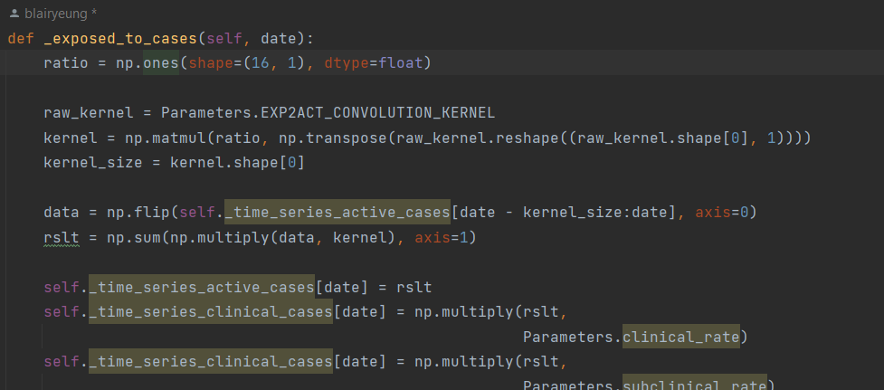
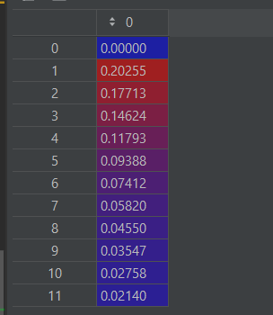
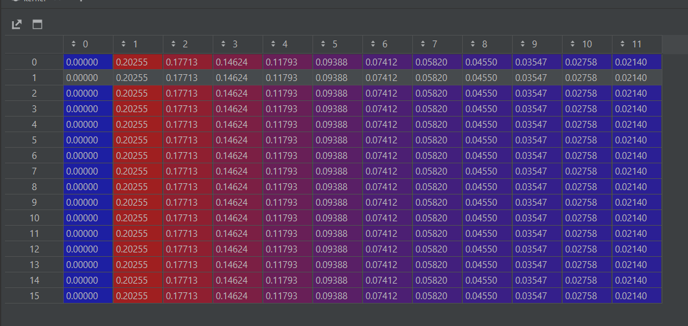
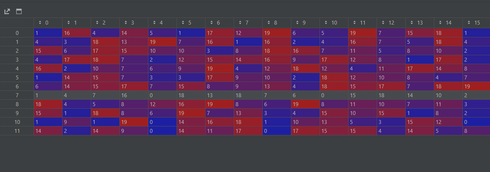
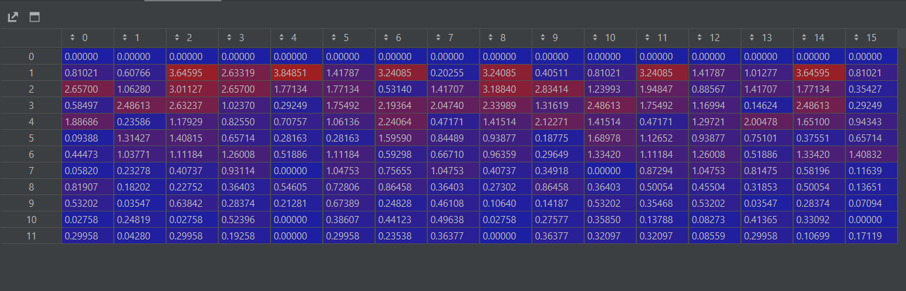
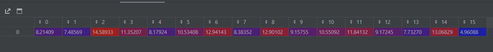

# Forecasting the transmission of SARS-CoV-2 in Ontario using inter and intra-county population mobility: a mathematical modelling study

Liwei Yang*1, 2 ([blairyeung](https://github.com/blairyeung)), Yuhao Yang1, 
Muxin Tian 1 ([realtmx](https://github.com/realtmxi))

 1 Department of computer science, University of Toronto, 40 St George St, Toronto, M5S 2E4, Canada

 2 Department of Cell & Systems Biology, University of Toronto, 25 Harbord St, Toronto, M5S 3G5, Canada

 * This is the corresponding [author](blair.yang@mail.utoronto.ca).

## This is an ongoing project
The model can run now! However, there are still some **features** not implemented yet and some **calibrations** to be done.

## TODOs:
### Data to be collected
* Average delay from COVID-19 onset to `hospitalization` for the ***omicron variant*** of SARS-CoV-2. **Preferably** age-specific.
* Average delay from COVID-19 onset to `admission of ICU` for the ***omicron variant*** of SARS-CoV-2. **Preferably** age-specific.
* Specific dose administration count. (The current one contains 1, 2, 3 doses only. We may want to include 4, 5 dose.

### Features to be implemented
* Forecasting the `population mobility` using previous Google mobility.
* Use the synthesized commutation matrix to compute the inflow and outflow `mobility of inter-county population`.
* Use the inter-county population flow to estimate the inter-county flow of infected and immunized individuals.

### Model fitting
The model need to be fitted to the previous year's transmisison of COVID-19 before it is used for forecast. 

Currently working on the calibration and optimization of the model.

## Completed features:
### Vaccine effectiveness
We estiamted the vaccine effectiveness using the vaccination effectiveness derived [Andrews et al.](), [Gold](),
[CDC]()

### Population mobility:

### Intra-county SEIR model for VOC B.1.1.529 of SARS-CoV-2

### Seasonality
We modelled the seasonality of the transmissiblity of SARS-CoV-2 using a sinous funuction.

## Model description
The specific beamer file is [here](https://github.com/blairyeung/Commuting_TSF_SARS-Cov-2_model_master/blob/main/beamer.pdf). 

## 2.1 Transition between states

**Algorithm 1:** Transition from exposed individuals to infected individuals

使用矩阵乘法及哈达玛积计算新增病例数量。\
 \
其中， **raw_kernel** 为样本数量为 n 的概率分布，0-11 代表自感染后的天数（1-12天）， 数值对应一个病毒
者在第 n 天转变为病例的概率。 kernel均被归一化（normalized）。
### ***这里是一个例子***
我们首先对ratio（16， 1）转置后的kernel（1，12）求矩阵积 （M） np.matmul(ratio, np.transpose(raw_kernel))

**Figure 1**: 概率分布和转换率的矩阵积，行代表 -天数，列代表年龄段。i行j列为， 年龄段为 i 的个体在第 j 天
由携带者转变为病例的概率。
\
\
\
然后，我们通过self._time_series_infected得到过去12天中，16个年龄段每个年龄段
的感染人数。(N)

**Figure 2**: 在过去12天，16个不同年龄段的感染人数。 行代表 -天数（自今天 -n 天），列代表16个年龄段。\
\
\
\
然后，我们求M矩阵在N矩阵上的卷积。但由于我们只在乎今天新增的人数，该操作等效为将M矩阵竖向反转后，
与N矩阵求矩阵积 numpy.matmul(np.flip(M, axis=0), N)。经过这个操作，我们将得到以下矩阵。（Q）

**Figure 3**: 在过去12天，16个不同年龄段的感染人数中，**在今天由携带者转变为病例的人数**。 行代表 -天数（自今天 -n 天），列代表16个年龄段。\
\
\
\
然后，我们对矩阵的每一列求和，即可得出在今天新增的病例数。

**Figure 4**: 经过卷积计算（对每一列进行求和），在今天由携带者转变为新增病例的数量。每一列代表一个年龄段。
\
\
注意，由于所有的exposed individual (携带者) 都会转变为active cases（病例），故ratio值为 \
[1, 1, 1, 1, 1, 1, 1, 1, 1, 1, 1, 1, 1, 1, 1, 1] \
若我们定义 年龄小于20岁的个体不会转变为病例，大于60岁的个体有50%概率转变为病例，此时ratio为: \
[0, 0, 0, 0, 1, 1, 1, 1, 1, 1, 1, 1, 0.5, 0.5, 0.5, 0.5]\
\
其他各个state之间的转换均采用类似算法，但各自的概率分布（raw_kernel)和转换概率（ratio）不同。