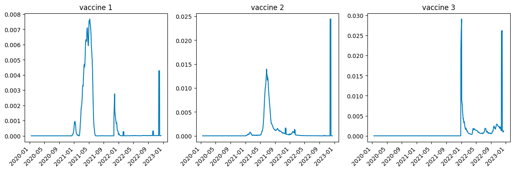

# Modelling the transmission of the omicron variant of SARS-CoV-2 in Ontario using inter and intra-county population mobility
Liwei Yang<sup>*1, 2</sup> ([blairyeung](https://github.com/blairyeung)), Yuhao Yang<sup>1</sup> ([martinyang0416](https://github.com/martinyang0416)), 
Muxin Tian <sup>1</sup> ([realtmx](https://github.com/realtmxi))

 <sup>1</sup> Department of computer science, University of Toronto, 40 St George St, Toronto, M5S 2E4, Canada

 <sup>2</sup> Department of Cell & Systems Biology, University of Toronto, 25 Harbord St, Toronto, M5S 3G5, Canada

 <sup>*</sup> This is the corresponding [author](blair.yang@mail.utoronto.ca).


#### **Figure 1:** The convolutional model.

## Input of the model
### Model parameters not subject to fitting:
#### Google population mobility index in Ontario

#### Figure 2: Google population mobility in Ontario.

***Assumed scenarios:***
```
1. Constant (use the moving average of year 2022)
2. Return to baseline (restore to baseline, four more assumptions)
3. Time-series forecast
```
### Seasonality of the transmission activity in Ontario

#### 
#### Figure 3: Seasonality of SARS-CoV-2 transmission activity
***Assumed scenarios:***
```
1. 10% sensonality
2. 20% sensonality
3. 40% sensonality
```
### Vaccination and vaccine effectiveness

#### Figure 4: Vaccination status in Ontario. The actual data we used are specified to public health unit.

* We used the phu-specific data to estimate the vaccine fraction of different ages bands.

* We used the provincial dose administration data to estimate the vaccination level.

* We then combined the two data to estimate the number of vaccine immunity for the counties.

***Assumed scenarios:***
```
1. Future vaccination performed as the ending speed.
2. No future vaccination
3. 100 - 500 boost dose per day per 100,000 poppulation
```


#### Figure 5: Vaccine effectiveness against clinical infection.
***Assumed scenarios:***
```
Unweighted average of multiple articles.
```
### Commutating matrix

#### Figure 6: Commuting matrix of Ontario, censused in 2015.
### 


## This is an ongoing project
The model can run now! However, there are still some **features** not implemented yet and some **calibrations** to be done.

## TODOs:
### Data to be collected
* Average delay from COVID-19 onset to `hospitalization` for the ***omicron variant*** of SARS-CoV-2. **Preferably** age-specific.
* Average delay from COVID-19 onset to `admission of ICU` for the ***omicron variant*** of SARS-CoV-2. **Preferably** age-specific.
* Average delay from COVID-19 onset to `death` for the ***Omicron variant*** of SARS-CoV-2. **Preferably** age-specific.
* Specific dose administration count. (The current one contains 1, 2, 3 doses only. We may want to include 4, 5 dose.
* Vaccine effectiveness against general infection (**estimated prior distribution using posterior distribution** probability).
* Vaccine effectiveness against symptomatic disease, **given** infection (conditional prior distribution).
* Vaccine effectiveness against hospitalization, **given** infection (conditional prior distribution).
* Vaccine effectiveness against deaths, **given** infection (conditional prior distribution).
 
### Features to be implemented
* Forecasting the `population mobility` using previous Google mobility.
* Use the synthesized commutation matrix to compute the inflow and outflow `mobility of inter-county population`.
* Use the inter-county population flow to estimate the inter-county flow of infected and immunized individuals.

### Model fitting
The model need to be fitted to the previous year's transmisison of COVID-19 before it is used for forecast. 

Currently working on the calibration and optimization of the model.

## Completed features:
### Vaccine effectiveness
We estiamted the vaccine effectiveness using the vaccination effectiveness derived [Andrews et al.](), [Gold](),
[CDC]().

### Population mobility & seasonality
The model can now accept and use population mobility & seasonality ot estimate 

### Calibration and vaccine effectiveness
We are currently working on the calibration of the model.